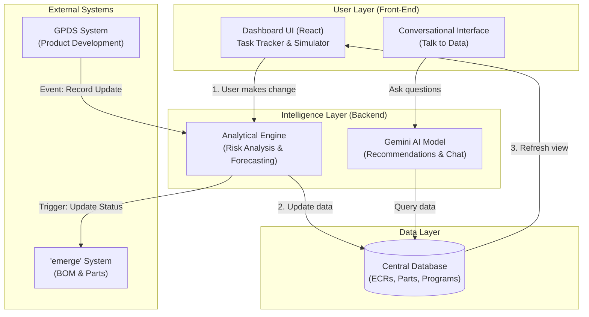

# Solution Architecture: Automated Program Intelligence

This document outlines the high-level architecture for the Strategic OEM Dashboard and its supporting ecosystem, based on feedback from mentor discussions and Google technical team proposals.

---

## 1. High-Level Architecture Diagram

Here is a simple view of how the pieces fit together, from the user interface down to the data sources.

---

## 2. Core Pillars

### A. Individual-Level Risk Analysis and Prioritization
*   **Concept**: Moves beyond due-date sorting to impact-based prioritization.
*   **Function**: Identifies tasks that create the largest downstream delays (the "critical 20%").
*   **Value**: Helps users focus on critical path items rather than just immediate deadlines.

### B. Conversational and Actionable Leader Intelligence
*   **Concept**: "Talk to your data" via a conversational interface.
*   **Function**: Uses Gemini to answer questions like *"Will everything be on track?"* and provides specific risk breakdowns.
*   **Value**: Eliminates manual static reporting for leadership.

### C. System Integration and Automation
*   **Concept**: Event-driven communication between core systems (emerge, GPDS).
*   **Function**: An update in GPDS automatically triggers updates in emerge.
*   **Value**: Eliminates manual "swivel-chair" work and prevents premature sign-offs.

---

## 3. Interaction Flow (Demo Context)
When a user adjusts task duration in the dashboard:
1.  The **Front-End (React)** sends the update to the **Analytical Engine**.
2.  The Engine recalculates critical paths and saves state to the **Database**.
3.  The Database broadcasts the change back to the UI for real-time KPI updates.
